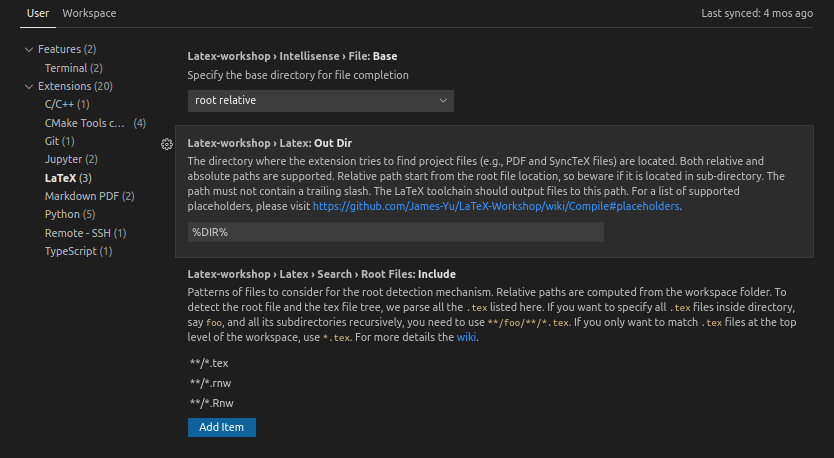
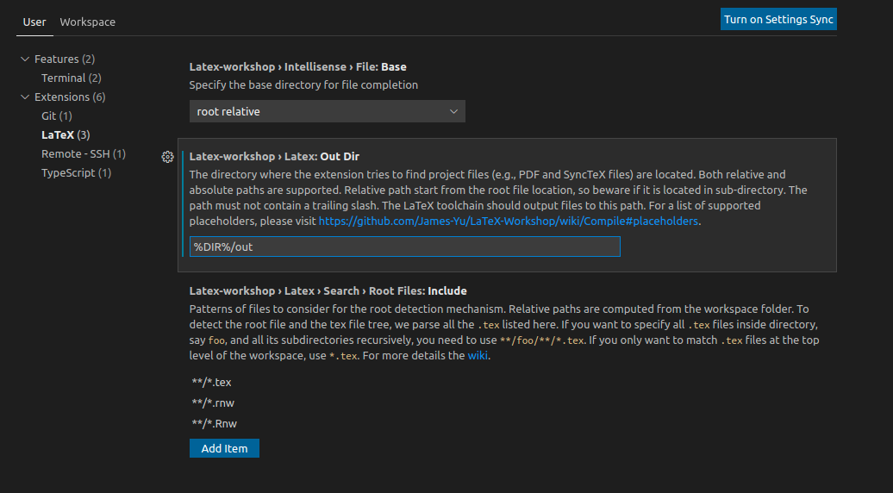
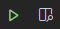
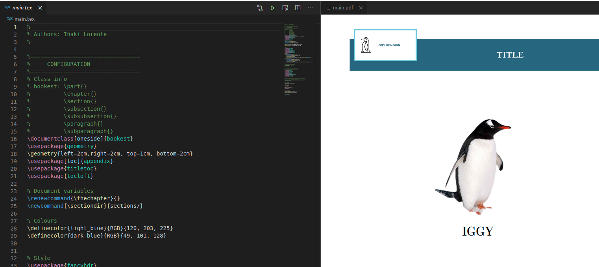

## LATEX TEMPLATE using VSC

This repository shows how to use `latex` on `Visual Studio Code`. I used a custom simple `latex template`

You can find a more extended documentation [here](https://iggyrrieta.medium.com/using-latex-on-visual-studio-code-eea538d69d90)


## Requirements & installation

> Tested on Ubuntu 20.04 but it should be very similar on other OS. Just download the right `texlive` file on https://ctan.javinator9889.com/systems/texlive/tlnet/ depending on your OS and then set the path properly.

1. Download `tex live` -->  http://mirror.ctan.org/systems/texlive/tlnet/install-tl-unx.tar.gz

2. Unzip --> `tar zxvf install-tl-unx.tar.gz`

3. Installation `sudo ./install-tl` (While installing select option `I`)

> This may take some time (around 45min in my case)

4. Add the following to  `~/.bashrc`:

```bash
#==============
# Latex
#==============
export MANPATH="/usr/local/texlive/2021/texmf-dist/doc/man:$MANPATH"
export INFOPATH="/usr/local/texlive/2021/texmf-dist/doc/info:$INFOPATH"
export PATH="/usr/local/texlive/2021/bin/x86_64-linux:$PATH"
```

5. [VSC] Install extension `LaTeX Workshop` in VSC


## Usage

### From terminal

This is only necessary in case you want to use `latex` from terminal and compile changes that way. In that case you can make use of the `Makefile` created for that purpose.

Go to  `~/path_to_this_project/latex_vsc` on terminal:

1. Compile

```bash 
make
```
This will generate all files inside `out/` folder

2. In case you want to remove all files in `out` folder

```bash 
make clean
```


### Using Visual Studio Code

This is the simplest case scenario. In this case, you can totally work with your latex project using `Latex-workshop` extension.

Open Visual Studio Code and go to  `Latex Workshop` settings, modify `Out Dir` option:

1. This is the default state




2. This is how it should be




This is the only settings you need to change. Once this is done you can work on your project and test your changes live using the following buttons:



Example:



From now on, every time you save your changes you will see that automatically applied on the `pdf` on your right

